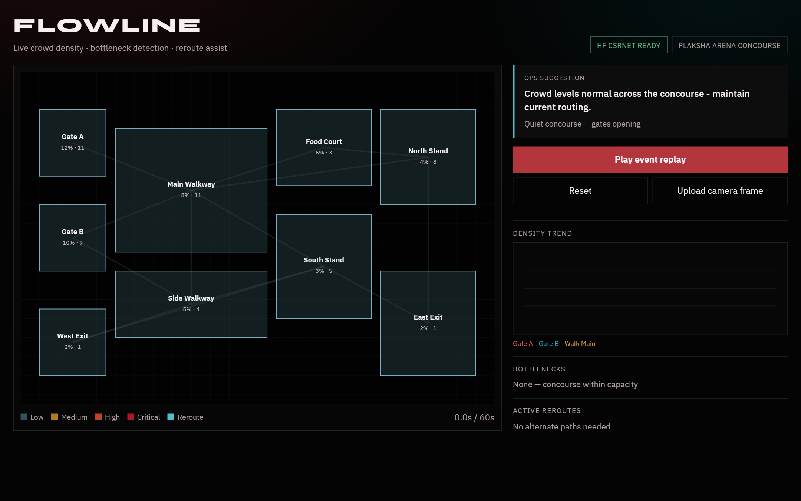
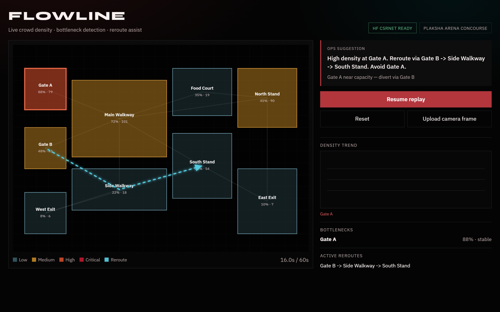
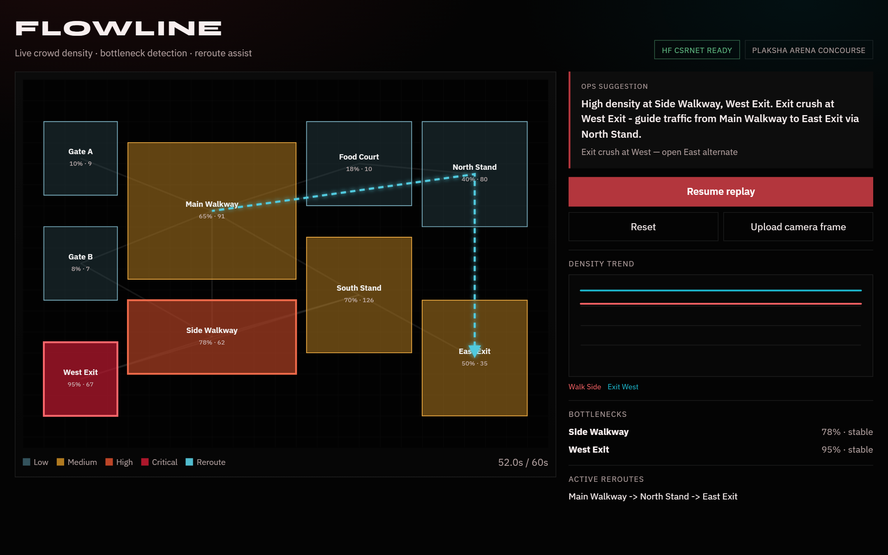
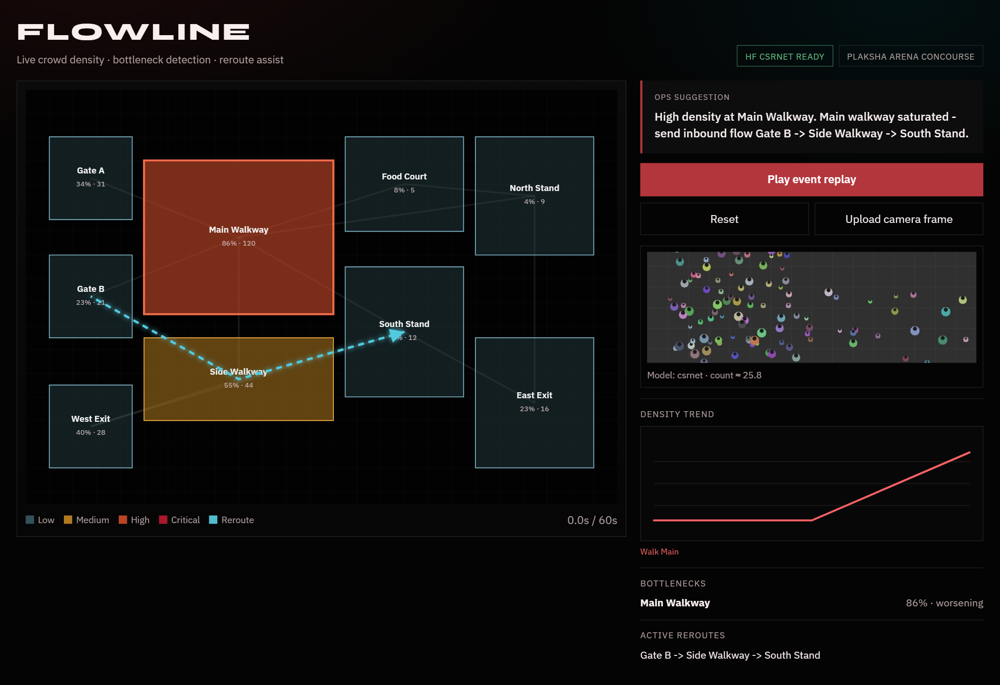

# FLOWLINE

Crowd-operations prototype for venues: see density form, flag bottlenecks, suggest reroutes before queues turn unsafe.

This branch (`angular-22`) is the **Angular 22** console plus GraphQL. Checkout `main` for the original **React/Vite** console.



**Apps**

- `apps/ops-console` — Angular 22 control-room dashboard (Apollo GraphQL, including camera upload)
- `apps/crowd-api` — FastAPI + Strawberry GraphQL + CSRNet (Hugging Face) + risk + routing

**Contracts**

- `packages/contracts/openapi.json` — REST OpenAPI + generated TS client
- `packages/contracts/schema.graphql` — GraphQL SDL for Angular codegen

## Screenshots

### Entry rush — Gate A bottleneck + reroute



### Exit crush — West Exit critical, divert east



### Camera upload — live CSRNet inference



Regenerate screenshots (API on `:8001`, console on `:5173`):

```powershell
npm run screenshots
```

Needs **Node 24.19.0** (`fnm use` from `.node-version`, or Node `^22.22.3 || ^24.15.0`). Then:

```powershell
python -m venv .venv
.\.venv\Scripts\pip install -r apps\crowd-api\requirements.txt httpx pytest
npm install
.\.venv\Scripts\python scripts\export_openapi.py
.\.venv\Scripts\python scripts\export_graphql.py
npm --workspace packages/contracts run generate
.\.venv\Scripts\python scripts\stamp_contracts.py
npm --workspace apps/ops-console run codegen
.\.venv\Scripts\python scripts\stamp_graphql.py

# API
$env:PYTHONPATH = "apps\crowd-api"
.\.venv\Scripts\python -m uvicorn app.main:app --reload --reload-dir apps\crowd-api\app --host 127.0.0.1 --port 8001

# Console
npm --prefix apps/ops-console run dev
```

Open http://127.0.0.1:5173

GraphQL endpoint: http://127.0.0.1:8001/graphql

If you use [Task](https://taskfile.dev): `task setup`, `task contracts`, `task dev`, `task check`.

## Demo

See [docs/demo.md](docs/demo.md). Sample frames live in `samples/camera-frames/`.

React → Angular mapping: [docs/migration.md](docs/migration.md). Architecture: [docs/architecture.md](docs/architecture.md). Switch branches: `main` (React) vs `angular-22` (Angular 22).

```text
Camera / replay  →  crowd-api  →  ops-console map
                      ├─ GraphQL (venue, ticks, reset, model status, analyzeCamera, demoPlayback WS)
                      ├─ REST /api/analyze (OpenAPI compatibility)
                      ├─ CSRNet (HF) or heuristic
                      ├─ capacity risk
                      └─ density-weighted routes
```

## Hugging Face

- Model: [`rootstrap-org/crowd-counting`](https://huggingface.co/rootstrap-org/crowd-counting)
- Dataset card: [`rootstrap-org/crowd-counting`](https://huggingface.co/datasets/rootstrap-org/crowd-counting)

## Test and production build

```powershell
$env:PYTHONPATH = "apps\crowd-api"
.\.venv\Scripts\python -m pytest apps\crowd-api\tests -q
npm --prefix apps/ops-console run lint
npm --prefix apps/ops-console run test
npm --prefix apps/ops-console run typecheck
npm --prefix apps/ops-console run build
```

Docker: `docker compose up --build` (console on http://localhost:5173, API on http://localhost:8001). Requires Docker Desktop on PATH.
